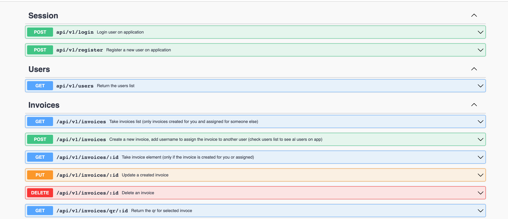

# Ruby on rails API Invoices (API service)

This app is a take-home assessment for a job interview. The idea is to create an API service to manage invoices. Check the [guidelines](GUIDELINES.md) for more details.

## API documentation

One you run the application, the root page (`localhost:3000`) will show the API documentation. You can also check the [API documentation](./swagger/v1/swagger.yaml) file.

## Tests with RSpec

This website was tested with [Rspec](https://en.wikipedia.org/wiki/RSpec)

## 🔧 Built With these features

- Ruby 3.1.0
- Rails 6.1.6.1
- Bundle 2.3.3
- PostgreSQL 14.2
- Rubocop gem 1.33.0
- Rspec gem 3.11
- Swagger gem 2.5.1

## 🛠 Getting Started

## Install

To get a local copy up and running follow these simple example steps.

- Open a terminal
- Copy this code : `git clone https://github.com/vichuge/ror-api-invoices.git`
- And then `cd ror-api-invoices`

## Run the application

- Run the program with this code : `bundle install`
- Then run `rails db:create`, `rails db:migrate`
- Or run `rails db:setup` to do it all at once
- now you can run `rails server` or `rails s` to start the server
- Stop the program with: "Ctrl + C" (Windows or Linux) or "Command + C"(Apple)

## Run tests

- After you have run the application, you can run the tests with the command `rspec`

## Open app in browser/postman

- When the program is running go to your browser.
- put: localhost:3000/ (this is the default port, here you caan see the API documentation)
- To create a user, go to: localhost:3000/api/v1/register and follow the API documentation
- To login, go to: localhost:3000/api/v1/login and follow the API documentation
- Is preferable to use [postman](https://www.postman.com/) to test the API

## Upload hundreds of invoices

- To upload hundreds of invoices, you can use the taks `rake invoice:upload_invoices`

## Documentation

- Once the server is ready, enter on root (`localhost:3000/`)

## ✒️ Author

👤 **Victor Pacheco**

- GitHub: [@vichuge](https://github.com/vichuge)
- LinkedIn: [LinkedIn](https://www.linkedin.com/in/victor-pacheco-7946aab2/)
- Twitter: [@Pachecofloresv](https://twitter.com/Pachecofloresv)

## 🤝 Contributing

Contributions, issues and feature requests are welcome!
Feel free to check the [issues page](https://github.com/vichuge/ror-api-invoices/issues).

## Show your support

Give a ⭐️ if you like this project!

## 📝 License

This project is [MIT](./LICENSE) licensed.
